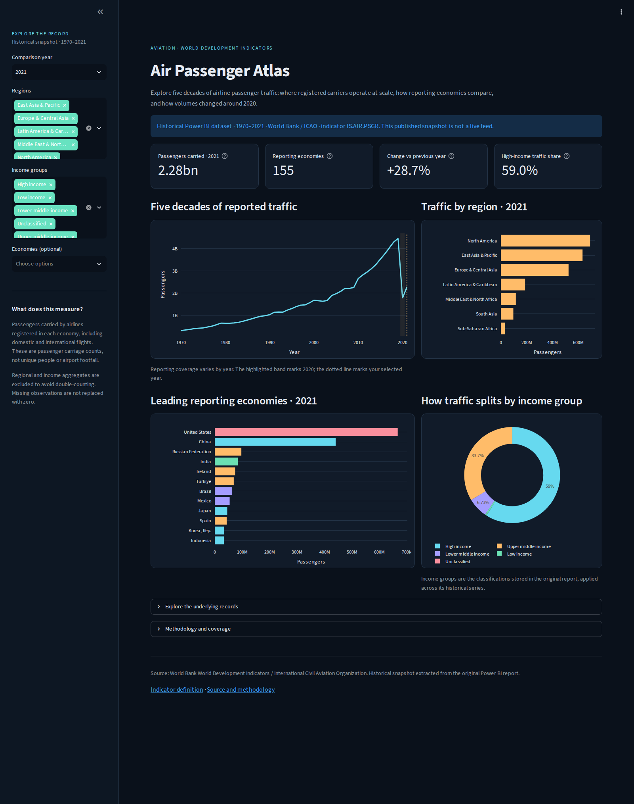

# Air Passenger Atlas

[](https://github.com/ShabibLiaqat/air-passenger-analysis/actions/workflows/build-showcase.yml)

A Power BI analysis adapted into a public-facing Streamlit dashboard exploring airline passenger traffic across reporting economies, regions, and income groups from **1970 to 2021**.



## The analytical question

How do passenger volumes carried by registered airlines vary across economies and income groups, and how did traffic change around 2020?

The original project folder was named “Air Freight Analysis”, but its source indicator is **air transport, passengers carried** (`IS.AIR.PSGR`). This showcase uses the passenger indicator and its actual unit rather than labelling those values as freight.

## What you can explore

- A selected-year passenger total and number of reporting economies.
- Year-over-year change using only economies reporting in both adjacent years.
- Historical traffic trends with reporting coverage available for inspection.
- Regional volumes, leading economies, and income-group shares.
- Year, region, income-group, and economy filters plus a CSV download of your selection.

## Findings in the historical snapshot

- **2020 contraction:** passenger carriage fell by **60.2%** versus 2019 across the 149 economies reporting in both years.
- **2021 recovery:** volumes increased by **28.7%** versus 2020 across 151 matched reporting economies.
- **Scale and concentration:** the 2021 selection totals **2.28 billion** passenger carriages across 155 reporting economies. The United States and China are the largest reported contributors.

These figures refer to the stored historical data and the stated reporting coverage. They do not describe current aviation conditions. See the [portfolio case study](docs/portfolio-story.md).

## Architecture and skills

The original Power BI report contains an observation table linked to country metadata, four DAX measures, and a dashboard with cards, trend/comparison charts, and slicers. Its embedded tables were extracted locally with [PBIXRay](https://github.com/Hugoberry/pbixray), preserving the original data values and model expressions.

The Streamlit adaptation uses validated CSVs, pandas for aggregation, and Plotly charts. GitHub Actions checks the data and calculations, starts the app, verifies chart rendering, and commits an updated README screenshot whenever app or dataset files change. The workflow also supports manual runs.

This project demonstrates Power BI modelling and DAX, data extraction, Python validation, interactive dashboard development, and automated portfolio publication.

## Methodology

1. **Grain:** one observation per economy/aggregate code and year. Duplicate keys fail validation.
2. **Aggregate exclusion:** records without an economy region in the original country metadata are excluded from country totals. Regional, global, and income-group series otherwise overlap with national records.
3. **Missing values:** absent observations remain absent. The dashboard never interprets them as zero traffic.
4. **Growth:** the adjacent-year comparison uses the intersection of economies reporting in both years, avoiding growth caused solely by a change in coverage.
5. **Income groups:** the original metadata snapshot is applied throughout the historical series; classifications are not reconstructed separately for each year.
6. **Interpretation:** passenger carriage relates to airlines registered in each economy. It does not measure unique travellers, freight tonnage, or arrivals at that economy's airports.

The historical dataset contains **9,898 observations**, including aggregate series. It is extracted from the original report and is **not a live API feed**. The screenshot workflow regenerates the presentation; it does not fetch new annual observations.

## Source and attribution

World Bank, World Development Indicators: [Air transport, passengers carried](https://data.worldbank.org/indicator/IS.AIR.PSGR), sourced from the International Civil Aviation Organization and ICAO staff estimates. See the [indicator methodology](https://databank.worldbank.org/metadataglossary/world-development-indicators/series/IS.AIR.PSGR). The published indicator is licensed under CC BY 4.0; the CSVs here are a historical extraction from the supplied Power BI report.

## Run locally

Requires Python 3.12.

```powershell
python -m pip install -r requirements.txt
python -m streamlit run app.py
```

To verify the analytical calculations and render a preview:

```powershell
python -m unittest discover -s tests
python -m src.data_model
python -m pip install -r requirements-automation.txt
python -m playwright install chromium
python -m src.capture_dashboard
```

## Public interactive hosting

Deploy this repository on [Streamlit Community Cloud](https://share.streamlit.io/) with branch **`main`**, entry file **`app.py`**, and Python **3.12**. No API credentials are needed. Once deployed, add the assigned public URL near the top of this README.

## Power BI materials

- [Original DAX measures](powerbi/Measures.dax)
- [Original relationships](powerbi/relationships.json)
- [Data dictionary and model notes](docs/data-dictionary.md)

The original PBIX remains unchanged in the local project folder. It is excluded from Git; the exported model documentation and data make the web adaptation reproducible without Power BI Desktop. If you have that file locally, rebuild the exports with:

```powershell
python -m pip install -r requirements-extraction.txt
python -m src.extract_powerbi "path/to/original-report.pbix"
```
